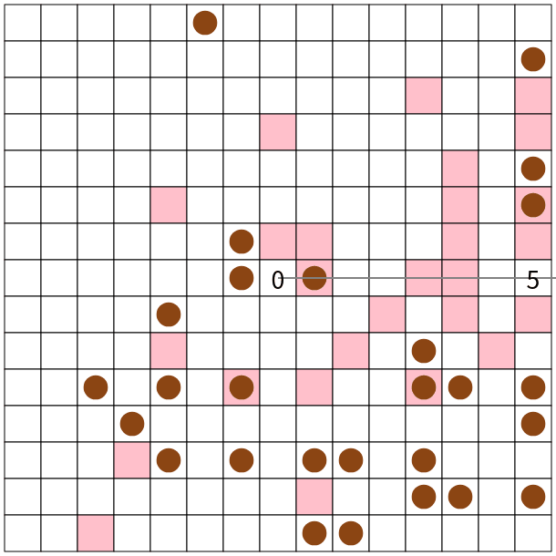
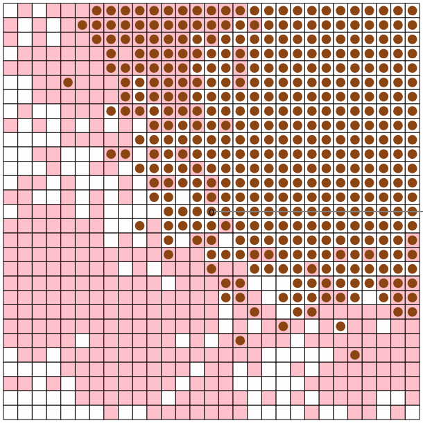
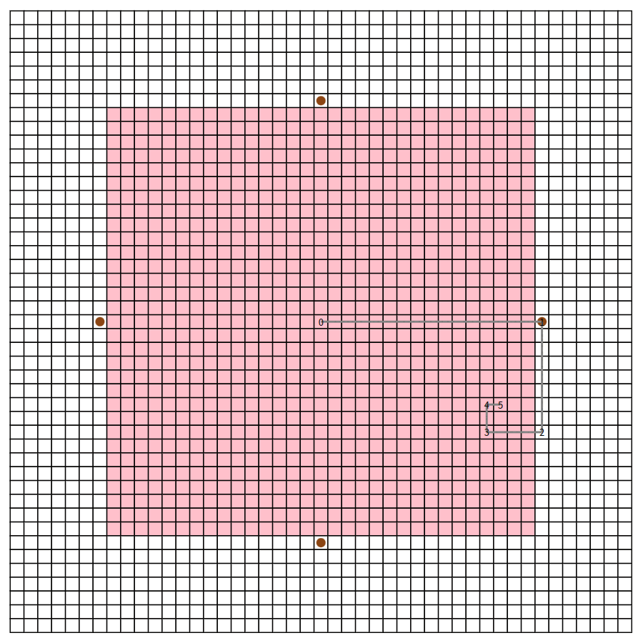

# ahc038

 

順位: 214th

パフォーマンス: 1662

[コンテスト成績証](https://atcoder.jp/users/tawainfer/history/share/ahc038)

 

seed: 0 score: 48

 

seed: 16 score: 286

 
 

## 考えたこと

- $N <= 30$ のとき、6個のノードがあれば2ターンで全てのマスに指先を動かせる

  カオス現象の話で、「いくつかの振り子を繋げて揺らすと複雑な運動が発生する」みたいなところから発想を得て、一直線にしたアームを回転させたとき、そこまで多くないノード数でも結構複雑な回転パターンが作れるのではと予想した。

  実験してみると予想通り、 $V = 5$ でもかなり多くのマスに指先を動かせた。辺の長さも変えてみると、2の累乗のとき効率良く到達可能なエリアを広げられそうだった。

  実験をもとにルールを作った。

  - 根の座標は中央 $(\frac{N}{2}, \frac{N}{2})$ とする。

  - アームは番号が一番大きいノードに新しいノードを付け加えていく。（一直線で指先は一つだけになる）

  - 辺の長さは根に近い方から $2^{V-2}$ で始めて、最後が 1( $2^0$ )になるように2で割っていく。

  「回転しない」「右に90度回転」「左に90度回転」といった操作が根以外のノードで出来るので、1 ターンでの回転パターンは $3^{V-1}$ 通りあるが、ここでは 2 ターン使って「180度回転」(['R','R'] or ['L', 'L'])する操作も含めて考える。最大 2 ターンを使った回転パターンは $4^{V-1}$ 通りになる。

  各パターンで操作後に指先があるマスを記録していくと、根から指先のマンハッタン距離が奇数かつ $\sum_{i=0}^{V-2} 2^i$ 
以下のマスに行けることが分かる。到達可能なマスをビジュアライザで確認すると菱形に広がったエリアが出来ている。

   

  ( $N = 45,$ 赤枠が $N = 31$ )

  

   

  回転操作の他にアーム自体を上下左右に移動する操作も同時にできるので、菱形に穴が空いている距離が偶数のマスにも2ターン以下で指先を動かせる。

  $V = 5$ の場合だけ、辺の長さを"8-4-2-1"みたいに決めていくと根から15しか距離が稼げず、到達可能なエリアは菱形に広がっている分、 $N$ が大きくて角にたこ焼きがあると勿体ない感じになる。

  それでも、大体のケースで掴む・置くが2ターンで出来るのでスコアを$4M$以下には出来る。1ターンで出来るだけ回転操作をやると$2M$に近づいていき、最初から目的地に置いてあるたこ焼きには触れないのでもう少し良いスコアになる。

   

- 指先を増やしてスコアを $2M$ から小さくしたい

  指先が一つだとこれ以上スコアを小さく出来ないのでどうやって指先を増やしたい。

  上記の方針で作った指先をメインの指先として、余っているノードを全てサブの指先として配置していく。

  入力生成方法を見た感じ、たこ焼きと目的地がそれぞれ固まった位置に生成されそうだったので、メインの指先周辺に出来るだけ配置することにした。

  メインの指先を作るのに5,6個のノードしか使っていない分、 $V = 15$ だと10個近く指先を増やせるし、結構スコアを伸ばせるかと思ったらほとんど伸びなかった。
  
  回転操作で2ターンより1ターンを選ぶ部分にしか注目せず、1ターンのマスが複数あったときにどこへ配置するかを考えなかったのが多分原因。
  
  目的地のエリアが固まってるなら端から置いていったほうが複数のたこ焼きを綺麗にはめられそう。何も考えずにエリアの真ん中とかに置いてると後半から掴む・置く操作が出来ずに拘束されたサブの指先が増えてしまう。
  
  Chokudaiサーチとか使えそうだったのにルールを作ることに集中してずっと貪欲を書いていたのが良くなかった。
